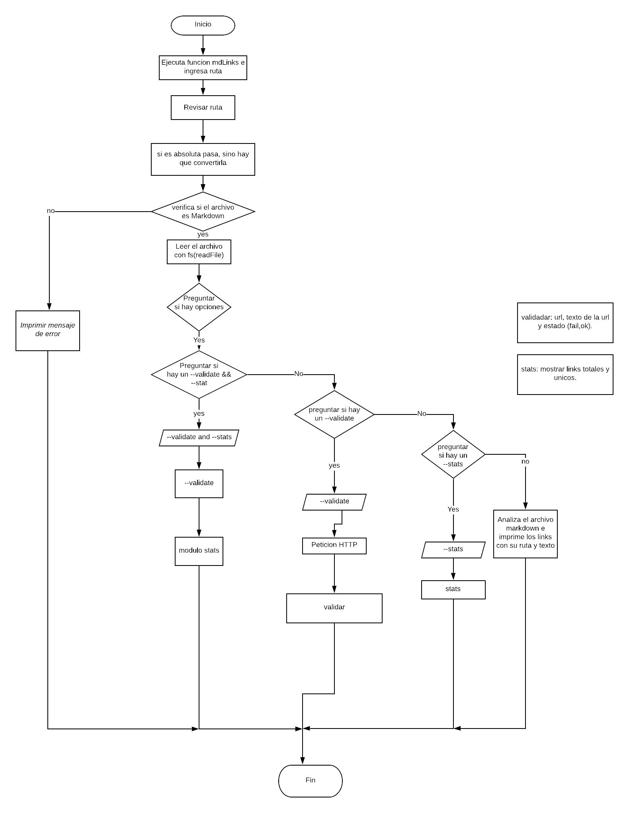
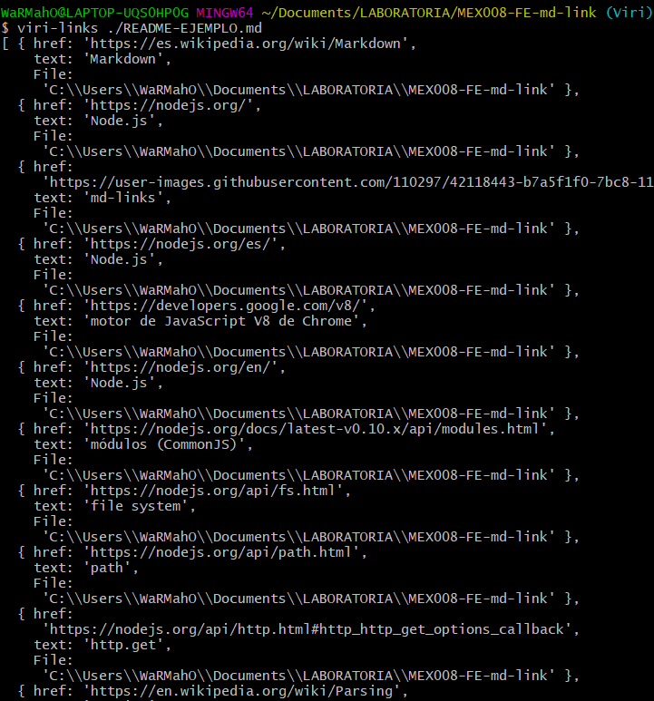
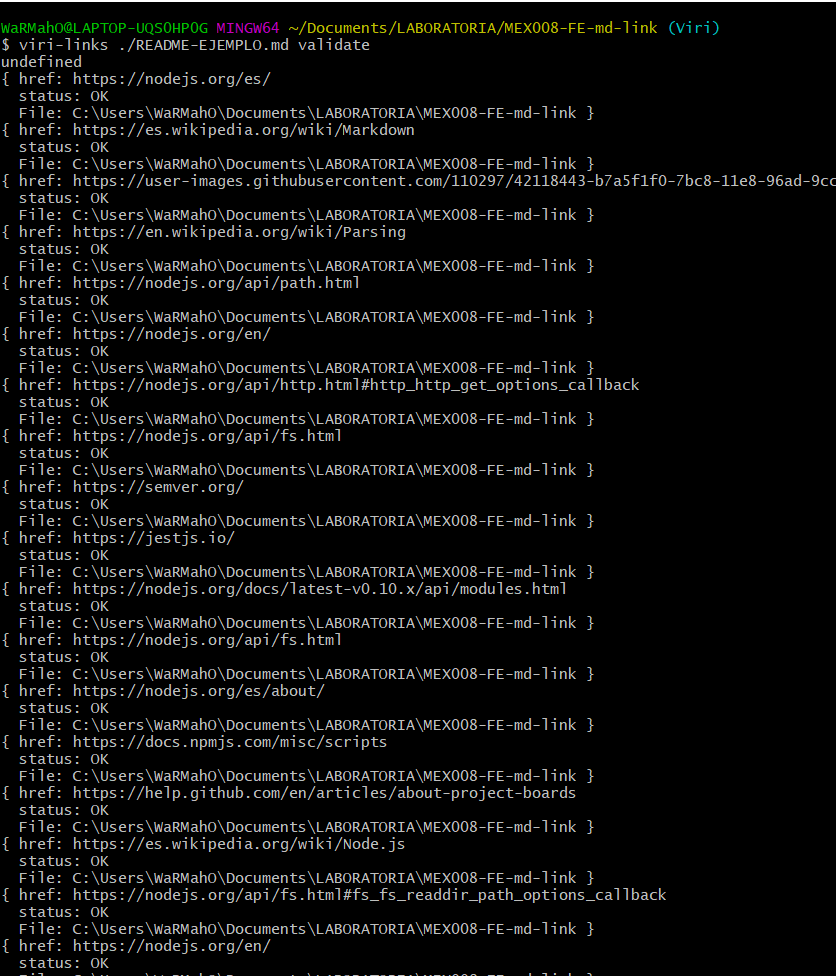
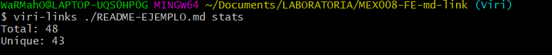
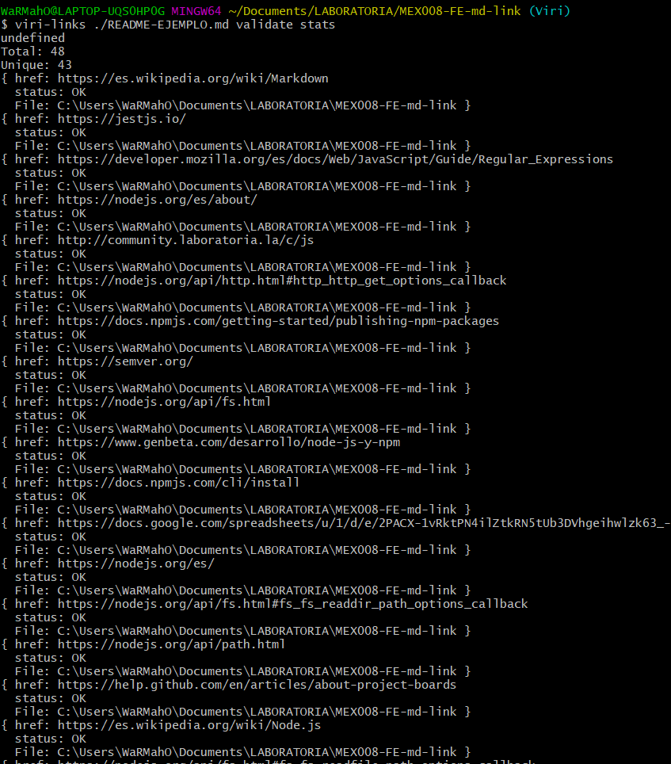

# Markdown Links

Este modulo fue diseñado con la finalidad de encontrar los links existentes en los archivos markdown
y poder verificar si siguen vigentes.


## Funcionamiento
The-links sigue la lógica del siguiente diagrama de flujo.



## Instalación

Para instalar la dependencia en tu proyecto debes ejecutar el siguiente comando desde tu consola .

```sh
 $ npm i the-links
 ``` 

## Funcionamiento Interfaz de Línea de Comando

* Ruta sin opciones

Para poder ejercutar the-links debes ingresar el siguiente comando seguido por la ruta relativa o absoluta del
archivo tipo .md que quieres revisar. Está ejecución imprimirá todos los links encontrados.

```sh

$ viri-links ./some/example.md

```


* Ruta con opción validate

Para conocer si los links de un archivo siguen vigentes o se han roto, debes ingresar el siguiente comando
el cual imprimirá todos los links y en caso de seguir activos, su estatus será "Ok", de lo contrario se imprimirá "Not Found".
```sh

$ viri-links ./some/example.md validate

```


* Ruta con opción stats

El siguiente comando imprimirá el total de links encontrados y el total de los que no se repiten.

```sh

$ viri-links ./some/example.md stats

```



* Ruta con opción validate y stats

Para obtener los links validados y el total de los mismos debes ingresar el siguiente comando en el orden que se muestra.

```sh

$ viri-links ./some/example.md validate stats

```


